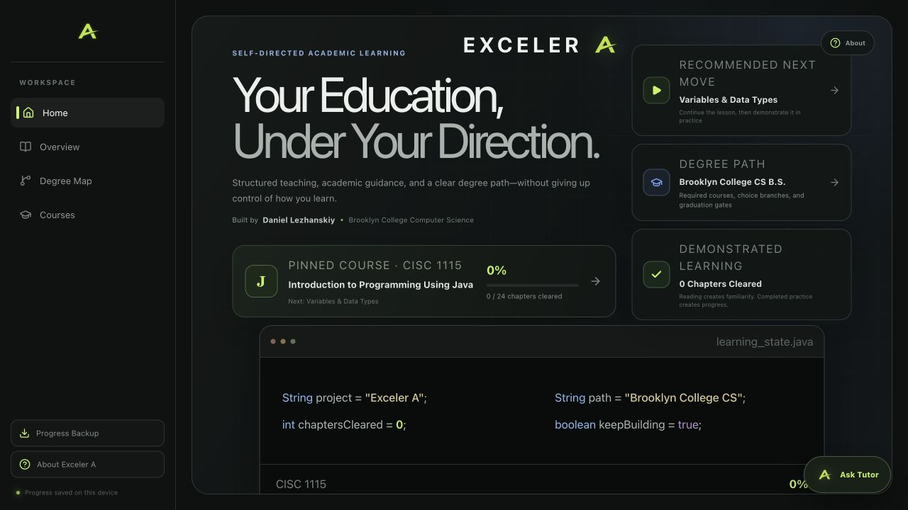
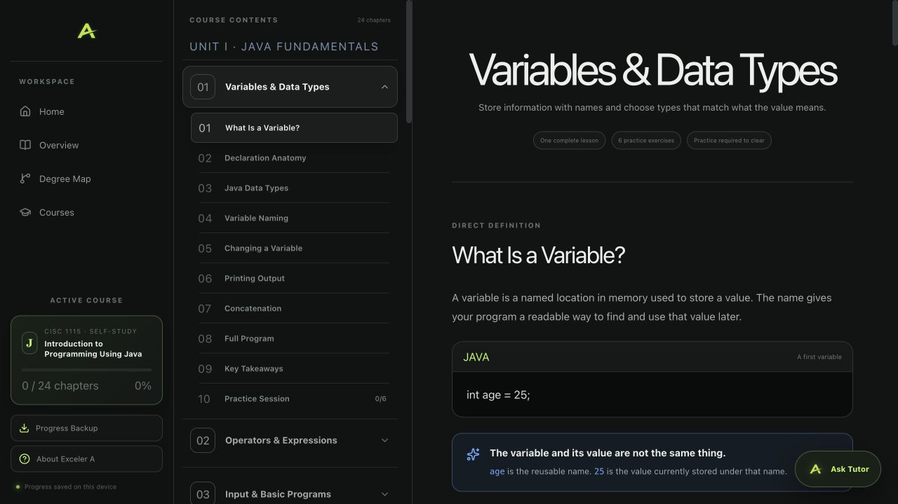
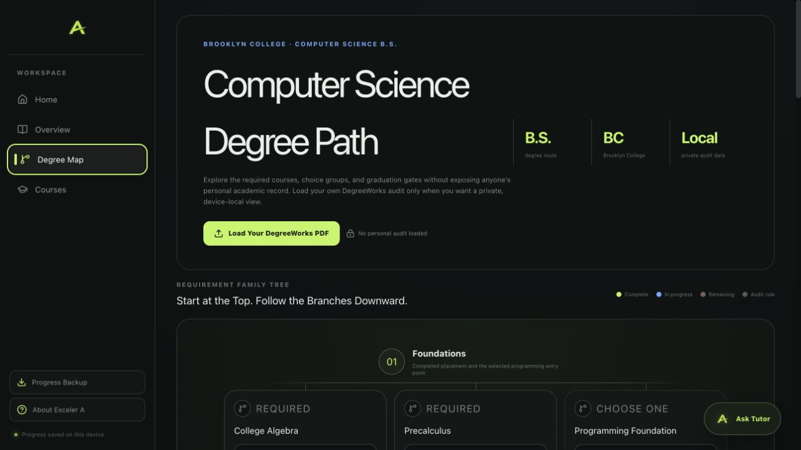

# Exceler A

Exceler A is a self-directed learning workspace built around the Brooklyn College Computer Science B.S. path, including its required supporting mathematics. It brings complete lessons, code-first practice, mastery testing, persistent progress, DegreeWorks mapping, and a contextual AI tutor into one focused interface.

The current public course library covers CISC 1115 and CISC 2210 alongside the MATH 1006 → MATH 1011 → MATH 1201 sequence. A visual degree map connects that self-study curriculum to the broader degree path while clearly marking courses that are still to come.

[Open the live project](https://daymark-os.daniellezhanskiy13.chatgpt.site) | [View the repository](https://github.com/DanielLezh13/exceler-a)

## Screenshots



| Structured Java lessons | Visual degree planning |
| --- | --- |
|  |  |

## Core Experience

- **Self-directed curriculum:** Five available courses span Java programming, discrete structures, College Algebra, Precalculus, and Calculus I, with full lessons and cumulative practice built around the Brooklyn College path.
- **Demonstrated practice:** Lessons combine direct explanations, code examples, hints, attempts, difficulty levels, and checked exercises. Reading introduces a concept; completed practice creates progress.
- **Mastery testing:** Unit assessments require learners to produce answers, revisit missed material, and retain immutable attempt history instead of treating content exposure as mastery.
- **Persistent per-user progress:** Anonymous learning remains on the current device. Signed-in students receive an isolated cloud workspace and can explicitly attach existing anonymous progress.
- **Degree planning:** A visual Brooklyn College Computer Science B.S. map shows required courses, choice branches, prerequisites, electives, and graduation gates.
- **Private audit import:** Signed-in students can privately load a DegreeWorks PDF. The original file is read in the browser and is not uploaded; only the reviewed structured result is saved.
- **Contextual tutor:** Signed-in students can use a course-grounded tutor with per-account limits, a global allowance, and assessment-integrity protections. A text-readable PDF can be attached to one chat for follow-up questions. The browser extracts up to 28,000 characters; that extracted text is saved with the private chat and sent to the tutor, while the original PDF file is not uploaded. Scanned pages require OCR first.

## Privacy Model

The public deployment begins with a clean, anonymous profile. Anonymous progress remains in that visitor's browser, and the repository does not include Daniel's personal GPA, DegreeWorks audit, or course history.

Students may sign in with ChatGPT for a private cloud workspace, DegreeWorks-derived degree status, and the protected tutor. Every database read and write is keyed from server-authenticated identity rather than a browser-supplied user ID. The OpenAI API key remains server-side. The core curriculum, practice system, degree map, and device-local progress remain usable without an account or AI connection.

## Technology

- React 19 and TypeScript
- Vinext and Vite
- Tailwind CSS 4
- Cloudflare Workers deployment
- D1-backed, per-student persistence with anonymous browser-local progress
- ChatGPT sign-in for identity-aware private features
- OpenAI Responses API for the rate-limited contextual tutor

## Project Structure

```text
app/
  api/student-state/       Private student workspace endpoint
  api/tutor/route.ts       Authenticated, rate-limited tutor endpoint
  data/cisc1115Course.ts   Course chapters, lessons, and practice
  data/math*.ts            College Algebra, Precalculus, and Calculus I
  data/cisc2210.ts         Discrete Structures lessons and assessments
  data/curriculum.ts       Degree-map requirements and relationships
  CommandCenter.tsx        Workspace navigation and primary views
  StructuredLesson.tsx     Lesson and practice presentation
  globals.css              Visual system and responsive layout
docs/screenshots/          Current product screenshots
public/                    Brand and social-preview assets
tests/                     Rendered-output checks
```

## Run Locally

Requirements: Node.js 22.13 or newer.

```bash
npm install
npm run dev -- --port 1300
```

Then open [http://localhost:1300](http://localhost:1300).

The learning workspace works without an API key. To enable the private AI tutor, create a `.env.local` file:

```bash
OPENAI_API_KEY=your_key_here
```

Never commit that file or expose the key in client-side code.

## Validation

```bash
npm run build
npm test
npm run audit:continuity
npm run audit:math
```

The continuity audits check the course library for missing instructional layers, undersized assessments, prerequisite gaps, and other curriculum-structure problems.

## Status

Exceler A is an independent student-built project. It is not an official Brooklyn College product and does not replace the college catalog or academic advising. Requirements can change, so degree-planning information should be confirmed with official college sources.

The course library will expand beyond its current five courses as additional parts of the degree path are built and reviewed.

## Author

Built by [Daniel Lezhanskiy](https://github.com/DanielLezh13).
